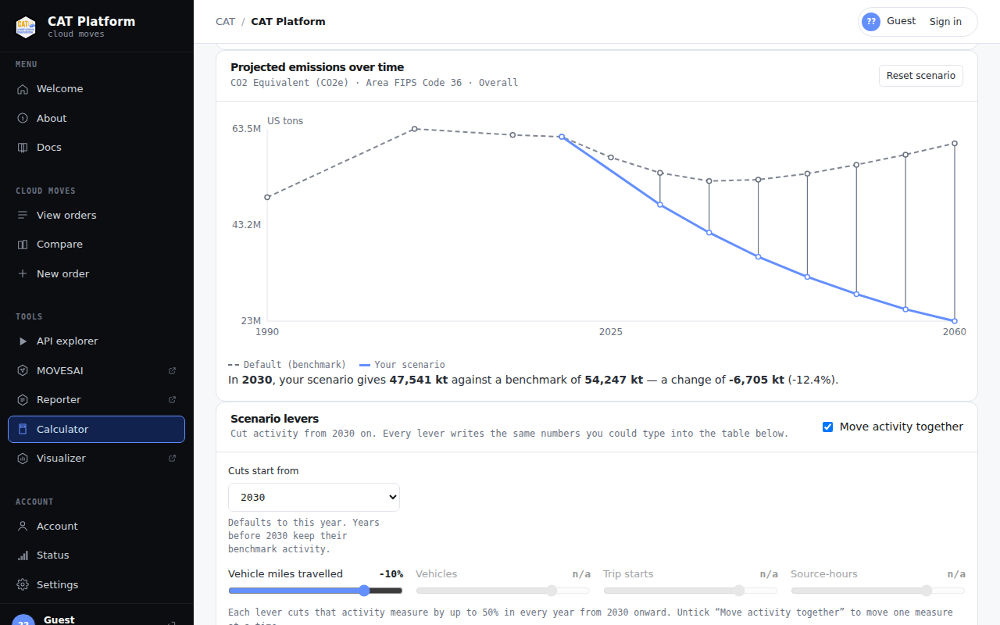
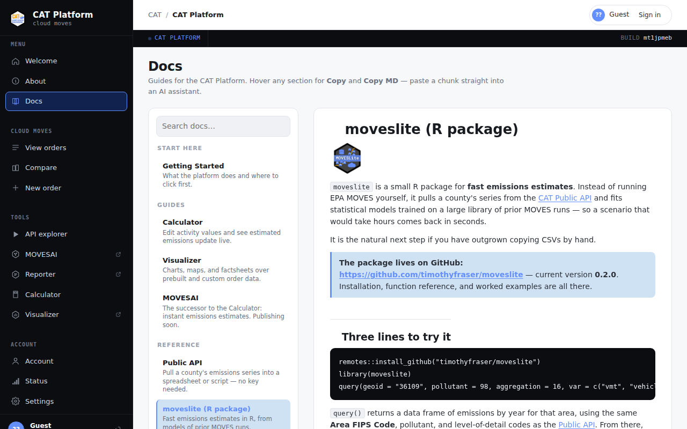

# `moveslite` <a href="https://github.com/timothyfraser/moveslite"></a>

**Fast transportation emissions estimates in R.**

`moveslite` turns a county's history of EPA MOVES runs into a small statistical
model you can re-fit and re-run in seconds — so you can compare a dozen policy
scenarios in the time it takes MOVES to set up one.

- **Version:** 0.2.0 · **Language:** R (>= 3.5.0) · **License:** MIT
- **Package authors:** Tim Fraser, Yan Guo
- **Install:** `remotes::install_github("timothyfraser/moveslite", subdir = "v2")`
- **Data source:** the [CAT Platform](https://cat-apps.com) public API, from the
  Cornell Climate Action in Transportation (CAT) team

---

## Why it exists

EPA's **MOVES** (MOtor Vehicle Emission Simulator) is the US regulatory standard
for on-road emissions, and it is precise, input-hungry, and slow. That is a poor
fit for the question planners actually ask: *what happens to emissions if we
change travel, a little, in fifteen different ways?*

`moveslite` answers that question from models fit to a large library of prior
MOVES runs — one model per area, pollutant, and level of detail. As the paper
behind the package puts it: *"While MOVES may take minutes-to-hours to estimate
one county-year's emissions, MOVESLite takes approximately 1 ms, with acceptable
accuracy."*

> Fraser, T., Guo, Y., & Gao, H. O. (2024). *Making MOVES move: Fast emissions
> estimates for repeated transportation policy scenario analyses.*
> **Environmental Modelling & Software, 178**, 106084.
> <https://doi.org/10.1016/j.envsoft.2024.106084>

---

## The same model, in a browser

The CAT Platform's **Calculator** runs the MOVESLite idea interactively: pick an
area, cut an activity measure, and watch the projected curve move against the
benchmark. It is the fastest way to see what the package does before writing any
R.



<sub>The CAT Platform Calculator, rendered from the platform against a local
sample of the live API's data.</sub>

The platform also hosts a `moveslite` page and a full reference for the public
API the package calls:

- **moveslite guide** — <https://connect.systems-apps.com/cat/#/docs/moveslite>
- **Public API reference** — <https://connect.systems-apps.com/cat/#/docs/api-reference>
- **Calculator** — <https://connect.systems-apps.com/cat/#/calculator>

The platform's front door is <https://cat-apps.com>.



---

## Install

```r
# install.packages("remotes")
remotes::install_github("timothyfraser/moveslite", subdir = "v2")
```

The package source lives in [`v2/`](v2/) — hence `subdir`. The repository root
holds the paper's replication material alongside it; see
[What's in this repository](#whats-in-this-repository).

## Quick start

```r
library(moveslite)

query(geoid = "36109", pollutant = 98, aggregation = 16,
      var = c("vmt", "vehicles"))
```

That returns a data frame of emissions by year for Tompkins County, NY — no key,
no account, no MOVES install. `check_status()` is a handy way to warm the API up
before a batch of calls.

---

## The workflow

Four exported functions carry the whole analysis:

| Step | Function | What it does |
| --- | --- | --- |
| 1. Pull | `query()` | GET a county or state's activity + emissions series from the public API |
| 2. Fit | `estimate()` | Fit an area-specific linear model of emissions on activity |
| 3. Project | `project()` | Predict a custom scenario, with confidence intervals, against the benchmark |
| 4. Check | `diagnose()` | Report adjusted R², residual error, and degrees of freedom for a formula |

`project()` does the fiddly parts for you: it calls the internal `setx()` to fill
in whatever activity measures you did not specify (linear interpolation across
years), detects that the outcome was log-transformed, and back-transforms the
estimate *and* its interval by simulation rather than naively exponentiating.

### Worked example

```r
library(moveslite)
library(dplyr)

# 1. Pull the benchmark series. estimate()'s default model uses all five
#    activity measures, so ask for all five.
benchmark <- query(
  geoid       = "36109",   # Tompkins County, NY
  pollutant   = 98,        # CO2 equivalent
  aggregation = 16,        # overall
  var         = c("year", "vmt", "vehicles", "starts", "sourcehours")
)

# 2. Fit the area-specific model.
model <- estimate(data = benchmark)

broom::glance(model)     # adj. R-squared, sigma, etc.

# 3. Ask a what-if question: what if 2023 VMT came in lower than projected?
qis <- project(
  m     = model,
  data  = benchmark,
  .newx = tibble(year = 2023, vmt = 343926),
  .context = FALSE
)

qis |> filter(type %in% c("custom", "benchmark"))
```

`project()` labels every row it returns:

| `type` | Meaning |
| --- | --- |
| `custom` | your scenario, with `emissions`, `lower`, `upper`, `se` |
| `benchmark` | the unedited series for the same year(s) |
| `pre_benchmark` / `post_benchmark` | surrounding years, returned when `.context = TRUE` |

### Model form

By default (`.best = TRUE`) `estimate()` fits the best-performing specification
from the paper:

```
log(emissions) ~ poly(log(vmt), 3) + poly(year, 2) + vehicles + sourcehours + starts
```

Set `.best = FALSE` to build a formula from whichever measures you pass in
`.vars`, and use `diagnose()` to compare candidates.

---

## Codes you will need

`query()` passes filters straight to the API, which expects **integer EPA IDs** —
`sourcetype = 21`, not `sourcetype = "Passenger Car"`.

**`geoid`** — a 5-digit county FIPS code (`"36109"` = Tompkins County, NY) or a
2-digit state FIPS code (`"36"` = New York).

**`pollutant`** — EPA pollutant codes:

| Code | Pollutant |
| --- | --- |
| `98` | CO₂ equivalent (CO₂e) |
| `2` | Carbon monoxide (CO) |
| `3` | Nitrogen oxides (NOₓ) |
| `110` | Fine particulate matter (PM2.5) |

**`aggregation`** — level of detail:

| Code | Level of detail |
| --- | --- |
| `16` | Overall |
| `8` | By vehicle type (sourcetype) |
| `14` | By fuel type |
| `12` | By regulatory class |
| `15` | By road type |

Full ID tables for every dimension live in the
[Public API reference](https://connect.systems-apps.com/cat/#/docs/api-reference) and in
EPA's [MOVES onroad cheatsheet](https://github.com/USEPA/EPA_MOVES_Model/blob/master/docs/MOVES4CheatsheetOnroad.pdf).
County FIPS codes are listed by the
[Census Bureau](https://www2.census.gov/programs-surveys/decennial/2010/partners/pdf/FIPS_StateCounty_Code.pdf).

---

## Pointing the package at a different host

Version 0.2.0 added a `base_url` argument to `query()`, `check_status()`, and
`get_default()`, so the API host is no longer hard-coded. Set it once for the
session:

```r
options(moveslite.base_url = "https://cat-apps.com/cat-public/")
```

Or per call:

```r
query(geoid = "36109", base_url = "https://connect.systems-apps.com/cat-public/")
```

Precedence is: the `base_url` argument → the `moveslite.base_url` option → the
`MOVESLITE_BASE_URL` environment variable → the historical default. Trailing
slashes are optional, and base URLs with a path prefix work, so the client can be
pointed at any replica of the API.

Since 0.2.0 a non-200 response also raises an informative error naming the status
code and the URL, instead of quietly handing back a raw response object that
downstream code might mistake for data. See [`v2/NEWS.md`](v2/NEWS.md).

---

## How accurate is it?

The package's validation exercise fit MOVESLite models across a stratified sample
of US counties, pollutants, and levels of detail, and scored each against the
MOVES output it was approximating. For the best-performing specification, the
**median adjusted R² ranged from 97.5% to 99.7%** across the six pollutants
examined; CO₂e came in at **99.6%** (bootstrapped 95% CI: 99.6–99.7).

Those figures, and the tables and figures in the paper, are reproducible from the
scripts and result files in [`v1/diagnostics/`](v1/diagnostics/) — see that
folder's [README](v1/diagnostics/README.md) for what each script produces.

Accuracy is not uniform. In the same exercise, fits were strongest at the overall
level, close behind by fuel type, and weakest broken out by vehicle type — the
thinnest slices of data. `diagnose()` exists so you can check the fit for *your*
area, pollutant, and level of detail rather than trusting an average.

---

## What's in this repository

| Path | Contents |
| --- | --- |
| [`v2/`](v2/) | **The current package** — R source, `man/` docs, `NEWS.md`, and long-form docs in [`v2/docs/`](v2/docs/) |
| [`v1/`](v1/) | The original release, kept for provenance — including [`v1/diagnostics/`](v1/diagnostics/), the replication material for the paper |
| [`extra/`](extra/) | Logo and image assets |
| [`docs/img/`](docs/img/) | Screenshots used by this README |

Deeper reading lives in `v2/docs/`:
[functions reference](v2/docs/functions.md) ·
[architecture](v2/docs/architecture.md) ·
[use cases](v2/docs/use_cases.md).

---

## When to reach for something else

| You want | Use |
| --- | --- |
| One area, a few scenarios, no code | The [CAT Platform Calculator](https://connect.systems-apps.com/cat/#/calculator) |
| A handful of areas pulled into a spreadsheet | The [public API](https://connect.systems-apps.com/cat/#/docs/api-reference) directly |
| Many areas, scripted, with scenario projection | `moveslite` |
| An authoritative MOVES run on your own inputs | Run MOVES, or order a cloud run from the CAT Platform |

`query()` is a wrapper around a single plain `GET` returning CSV, so the same
numbers are a few lines away in Python or JavaScript — you would just do the
scenario modelling yourself.

---

## Citation

```bibtex
@article{fraser2024moveslite,
  title   = {Making {MOVES} move: Fast emissions estimates for repeated
             transportation policy scenario analyses},
  author  = {Fraser, Timothy and Guo, Yan and Gao, H. Oliver},
  journal = {Environmental Modelling \& Software},
  volume  = {178},
  pages   = {106084},
  year    = {2024},
  doi     = {10.1016/j.envsoft.2024.106084}
}
```

## Contact and related work

Questions, bugs, and user-testing partnerships: open an
[issue](https://github.com/timothyfraser/moveslite/issues) or email Dr. Tim
Fraser at <tmf77@cornell.edu>.

- CAT Platform — <https://cat-apps.com>
- Gao Labs @ Cornell — <https://gao.cee.cornell.edu/>
- More tools from the group — <https://github.com/Gao-Labs>

Licensed under the MIT License. See [`LICENSE.md`](LICENSE.md).
